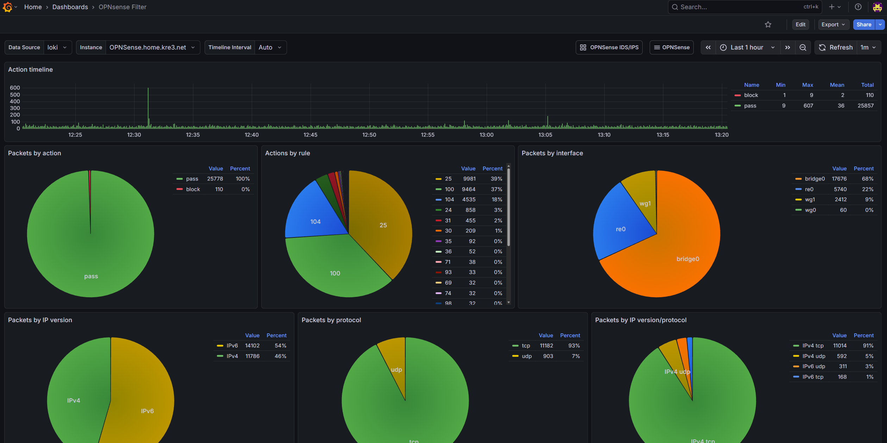
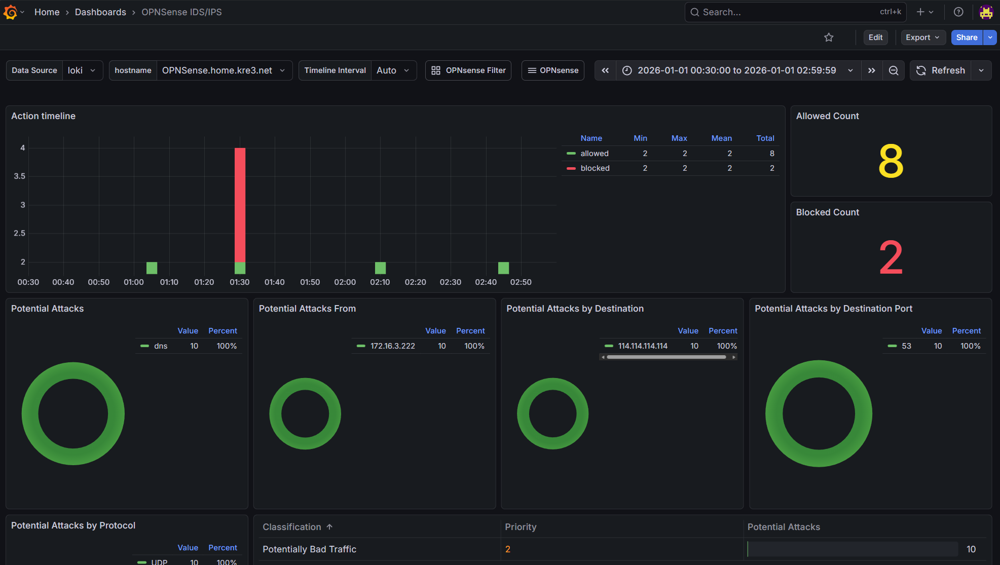
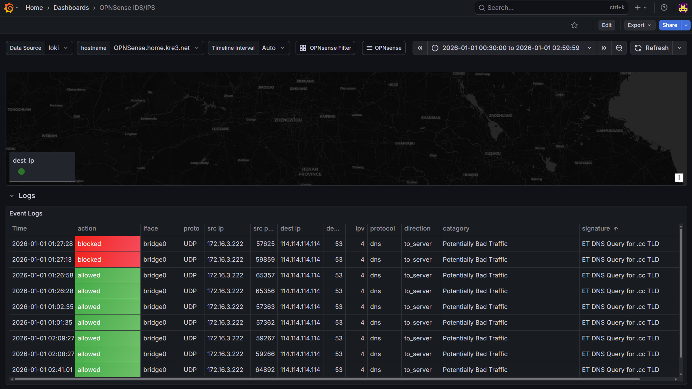

-----
## Final Product Screenshots


Click on the images to enlarge them.


1. OPNsense Firewall Dashboard


  
  


2. OPNsense IDS/IPS Dashboard


  
  



-----
## Main Monitoring Flow


graph LR;
A[OPNsense]-->B[Alloy];
B-->C[Loki]
C-->D[Grafana]


1. OPNsense sends syslog from `filterlog` / `suricata` to Alloy for collection and labeling
2. Alloy processes the logs and sends them to Loki for storage
3. Grafana connects to Loki for data visualization

-----
## Service Setup


Due to limited time for writing and the need for basic operational knowledge, the following sections will not detail every step (assuming readers already have basic operational knowledge). Only key steps and tips will be provided.


Since my entire Grafana stack is running with Docker, I won't detail the setup process here. Instead, here's the `docker-compse.yaml` as reference:
```yaml
---
# https://grafana.com/docs/grafana/latest/setup-grafana/installation/docker/
services:
  grafana:
    user: "1001:100"
    image: grafana/grafana:latest
    container_name: grafana
    environment:
      - TZ=Asia/Shanghai
      - GF_DEFAULT_INSTANCE_NAME=TurboKre_Dashboard
      - GF_SERVER_ROOT_URL=https://dash.example.com/
      - GF_SMTP_FROM_ADDRESS=no-reply@kre3.net
      - GF_SMTP_HOST=smtp.example.com
      - GF_SMTP_USER=admin
      - GF_SMTP_PASSWORD=password
    networks:
      - grafananet
    hostname: grafana
    ports:
      - 8090:3000
    volumes:
      - /path/to/grafana/data:/var/lib/grafana
    restart: unless-stopped

  loki:
    user: "1001:100"
    image: grafana/loki:latest
    container_name: grafana-loki
    hostname: loki # on port 3100
    networks:
      - grafananet
    volumes:
      - /path/to/loki/config.yaml:/etc/loki/local-config.yaml
      - /path/to/loki/data:/var/lib/loki
    command: -config.file=/etc/loki/local-config.yaml

  alloy:
    user: "1001:100"
    image: grafana/alloy:latest
    container_name: grafana-alloy
    hostname: alloy
    networks:
      - grafananet
    ports:
      - 8091:8091
      - 8092:8092
    volumes:
      - /path/to/alloy/config.alloy:/etc/alloy/config.alloy
      - /path/to/alloy/data:/var/lib/alloy
      - /path/to/alloy/GeoLite2-City.mmdb:/etc/alloy/GeoLite2-City.mmdb
    command: 
      - run
      - --server.http.listen-addr=0.0.0.0:12345
      - --storage.path=/var/lib/alloy
      - /etc/alloy/config.alloy

networks:
  grafananet:
    driver: bridge
```
Notes:
1. Since I used external file mapped volumes, permission issues may occur when storing files. Here I force the service to run as user `1001:100`. Please adjust according to your situation (using docker volume is recommended)
2. Grafana is recommended to configure SMTP email notifications for easy alerting via email
3. Pre-provide `GeoLite2-City.mmdb` to Alloy for IP geolocation mapping

-----
## Configure Loki
Write the following content to Loki's configuration file:
```yaml
auth_enabled: false

server:
  http_listen_port: 3100

common:
  path_prefix: /var/lib/loki
  storage:
    filesystem:
      chunks_directory: /var/lib/loki/chunks
      rules_directory: /var/lib/loki/rules
  replication_factor: 1
  ring:
    kvstore:
      store: inmemory

schema_config:
  configs:
    - from: 2020-10-24
      store: tsdb
      object_store: filesystem
      schema: v13
      index:
        prefix: index_
        period: 24h
```
1. Here, Loki, Grafana, and Alloy are configured in the same docker network, so no encryption or authentication is configured. If in k8s or public network environment, it's recommended to configure encryption or authentication
2. Loki's port is the default `3100`, which will be used later

-----
## Configure Grafana to Connect to Loki
In Connections ‣ Add new connections, add a Loki data source and fill in `http://loki:3100` in the Connection Url field.

Test and save the connection.

-----
## Configure Alloy
Write the following content to Alloy's configuration file:
```hcl
loki.write "local_loki" {
  endpoint {
    url = "http://loki:3100/loki/api/v1/push"
  }
}

loki.source.syslog "syslog_firewall" {
  listener {
    address = "0.0.0.0:8091"
    idle_timeout = "60s"
    label_structured_data = true
    labels = {
      job = "syslog",
      app = "filterlog",
    }
  }
  forward_to = [loki.process.firewall_ips.receiver]
}

loki.source.syslog "syslog_ids" {
  listener {
    address = "0.0.0.0:8092"
    idle_timeout = "60s"
    label_structured_data = true
    labels = {
      job = "syslog",
      app = "suricata",
    }
  }
  forward_to = [loki.process.ids_ips.receiver]
}

loki.process "firewall_ips" {
  forward_to = [loki.relabel.hostname_labels.receiver]

  stage.regex {
    expression = ",(?P<srcip>([0-9]+\\.[0-9\\.]+)|([0-9a-fA-F]*:[0-9a-fA-F:]+)),(?P<dstip>([0-9]+\\.[0-9\\.]+)|([0-9a-fA-F]*:[0-9a-fA-F:]+)),"
  }

  stage.geoip {
    source = "srcip"
    db = "/etc/alloy/GeoLite2-City.mmdb"
    db_type = "city"
  }

  stage.labels {
    values = {
      src_city_name = "geoip_city_name",
      src_country_name = "geoip_country_name",
      src_location_latitude = "geoip_location_latitude",
      src_location_longitude = "geoip_location_longitude",
    }
  }

  stage.geoip {
    source = "dstip"
    db = "/etc/alloy/GeoLite2-City.mmdb"
    db_type = "city"
  }

  stage.labels {
    values = {
      dst_city_name = "geoip_city_name",
      dst_country_name = "geoip_country_name",
      dst_location_latitude = "geoip_location_latitude",
      dst_location_longitude = "geoip_location_longitude",
    }
  }
}

loki.process "ids_ips" {
  forward_to = [loki.relabel.hostname_labels.receiver]

  stage.json {
    expressions = {
      srcip = "src_ip",
      dstip = "dest_ip",
    }
  }
  
  stage.geoip {
    source = "srcip"
    db = "/etc/alloy/GeoLite2-City.mmdb"
    db_type = "city"
  }

  stage.labels {
    values = {
      src_city_name = "geoip_city_name",
      src_country_name = "geoip_country_name",
      src_location_latitude = "geoip_location_latitude",
      src_location_longitude = "geoip_location_longitude",
    }
  }

  stage.geoip {
    source = "dstip"
    db = "/etc/alloy/GeoLite2-City.mmdb"
    db_type = "city"
  }

  stage.labels {
    values = {
      dst_city_name = "geoip_city_name",
      dst_country_name = "geoip_country_name",
      dst_location_latitude = "geoip_location_latitude",
      dst_location_longitude = "geoip_location_longitude",
    }
  }
}

loki.relabel "hostname_labels" {
  forward_to = [loki.write.local_loki.receiver]

  rule {
    action        = "replace"
    target_label  = "hostname"
    replacement   = "OPNSense.example.com"  # don't work, need investigation
  }
}
```

graph LR;
A[syslog_firewall:8901]-->B[firewall_ips];
B-->C[hostname_labels]
C-->D[local_loki]

E[syslog_ids:8902]-->F[ids_ips];
F-->C


Several important labels that will be used by the Dashboard later:
1. Must have `hostname`, which is placed in `loki.relabel "hostname_labels"` in the configuration file. In my personal testing, Alloy couldn't read `__syslog_connection_hostname` or `__syslog_message_hostname`, so I hardcoded it here (because I only have one machine to monitor). ~~If anyone could help me investigate this.~~ This `hostname` will be used by the Dashboard later to filter data sources
2. Must have `app` which must be either `filterlog` or `suricata`. Here, two different ports are used: `8901` for filterlog, `8902` for suricata. The Dashboard will use this later to determine which application the data comes from
3. For map data display, latitude and longitude are required: `src_location_latitude` `src_location_longitude` `dst_location_latitude` `dst_location_longitude`
4. To match IP geolocation, provide `/etc/alloy/GeoLite2-City.mmdb` to Alloy

-----
## Configure OPNsense to Send Syslog
### Configure IDS/IPS
Here it's assumed you've already configured IDS/IPS (i.e., enabled suricata, downloaded rule sets, and properly configured ports).

Enable `Enable eve syslog output` (`Enable syslog alerts` is optional), pushing structured logs to OPNsense's syslog;

In System ‣ Settings ‣ Logging ‣ Remote, add the following entry:
| Setting | Value |
| --------------------- | ----------------------------------------------- |
| Enabled               | True                                            |
| Transport             | TCP(4)                                          |
| Applications          | suricata (suricata)                              |
| Levels                | Info and above                                  |
| Hostname              | Alloy address                                   |
| Port                  | 8092                                            |
| rfc5424               | True                                            |

1. IPv4 TCP is recommended for the protocol, you can also choose IPv4 UDP, but I tested and couldn't get it to work
2. `rfc5424` is mandatory, otherwise logs won't be sent
3. If there are no logs for a while, go to Interface Diagnostics and capture packets on the LAN port for port 8092 to see if they're being sent. Normally logs are sent immediately after saving, but there's community feedback that this feature might be buggy. If no packets appear, restart OPNsense
4. Don't worry about sending unwanted logs to Loki; later analysis will only process structured logs. Selecting this many is to ensure eve logs are sent, but I also can't immediately find what level eve logs are. **Never select debug, it will cause a log explosion!**

### Configure Firewall
Still in System ‣ Settings ‣ Logging ‣ Remote, add the following entry:
| Setting | Value |
| --------------------- | ----------------------------------------------- |
| Enabled               | True                                            |
| Transport             | TCP(4)                                          |
| Applications          | filter (filterlog)                              |
| Levels                | Info and above                                  |
| Hostname              | Alloy address                                   |
| Port                  | 8091                                            |
| rfc5424               | True                                            |

1. Similarly, according to others' feedback, Info level logs alone should be fine, but here all are selected. **Never select debug, it will cause a log explosion!**

-----
## Configure Grafana Dashboard
I won't go into detail about how to build these panels. Inspiration came from [OPNsense & IDS/IPS](https://grafana.com/grafana/dashboards/17547-opnsense-ids-ips/) and [pfSense/OPNsense Filter](https://grafana.com/grafana/dashboards/22722-pfsense-opnsense-filter/). The Firewall panel was modified based on others' work, and the IDS/IPS panel was created following the design approach of the Firewall panel. If you want to learn how to build these panels, you can view the query statements and settings in edit mode yourself.

Since I've already modified them in advance, the label filters should match up. If you've modified the Alloy steps to your own labels, you can directly do a one-click replacement of the content in the json and import it into Grafana.


Click here to open the Firewall Dashboard file

<br/>
<br/>

Click here to open the IDS/IPS Dashboard file


Clicking the button will open the corresponding json file content in a new tab. Copy all the content and paste it in Grafana's import, and you can import both Dashboards.