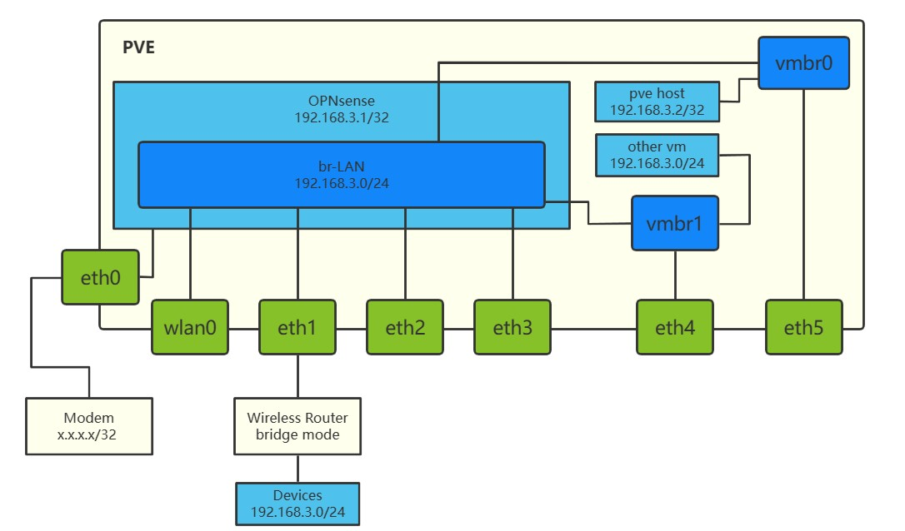

**注意！** 这篇文章仅仅是作为自己边鼓捣边摸索出来的产物，并非为一篇教程。

由于本人~~对于网络方面的知识一窍不通~~，所以并不能保证所有的内容全部正确，如有错误也欢迎指出。

<!--more-->



-----
**目录：**


-----
## 安装 PVE
直接在[官网上下载](https://www.proxmox.com/en/downloads/category/iso-images-pve) ISO 镜像，然后按照提示安装上去就行。

安装中记得记录一下 Summary 与 Install Successful 中的信息，之后可能会用到。

首次安装完成后如果想要访问 ssh、WebGUI 等，需要先连接到安装时指定的管理网口（这里是 enp6s0），再设置电脑网卡将 IP 设置为安装时设置的同子网但是与 pve 主机不同的 IP。如果还是访问不了的话可以试试关闭其他网络连接（比如 WiFi 等）。

## 设置 PVE
### 设置硬件直通
由于想要将部分网卡直通给 OPNsense，所以要修改一下设置让 pve 支持硬件直通。

在 WebGUI 的 node 处登录 Shell，修改 grub 文件 `/etc/default/grub`：`GRUB_CMDLINE_LINUX_DEFAULT=quite` 一栏的值为 `quite intel_iommu=on`（AMD 的就是`amd_iommu=on`）。保存后使用 `update-grub` 更新。

修改 `/etc/modules` 文件，添加以下内容：
```plaintext
vfio
vfio_iommu_type1
vfio_pci
vfio_virqfd
```
保存后，重启机器。

运行以下命令行来列出所有 IOMMU 组：
```bash
#!/bin/bash
shopt -s nullglob
for g in `find /sys/kernel/iommu_groups/* -maxdepth 0 -type d | sort -V`; do
    echo "IOMMU Group ${g##*/}:"
    for d in $g/devices/*; do
        echo -e "\t$(lspci -nns ${d##*/})"
    done;
done;
```

### 硬件直通故障排除
由于我有一张无线网卡，想要直通到 OPNsense 所在的虚拟机中。而直接设置直通的话 qemu 会报错：`failed to add PCI capability 0x11[0x70]@0x90: table & pba overlap, or they don't fit in BARs, or don't align`。

这里就需要多做一步：修改 pve 的 `/etc/pve/qemu-server/[虚拟机ID].conf`，在文件一行加上：
```conf
# 这里无线网卡在虚拟机中分配到的是 hostpci4，按需修改
args: -set device.hostpci4.x-msix-relocation=bar2
```
更多信息可以参考：[Failed to PCI passthrough SSD with SMI SM2262 controller. - Kernel.org Bugzilla](https://bugzilla.kernel.org/show_bug.cgi?id=202055#c47)、[PCIe Passthrough of Atheros AR9280 - Promox Forums](https://forum.proxmox.com/threads/pcie-passthrough-of-atheros-ar9280.45012/)

-----
## 安装和设置 OPNsense
### 安装 OPNsense
进入 pve WebGUI，上传 OPNsense 的 ISO 安装包。

在 pve 节点处新建一个网卡桥接，选择一个与管理网卡不同的网卡，且只填写 `Bridge Ports` 字段。这里名字为 vmbr1。

新建一个虚拟机，设置参数（记得在 CPU 设置里把 aes 功能打开），添加网络设备 vmbr1 ，在 `Hardware` 里添加 PCI 设备，先只添加 enp1s0。

启动虚拟机，首先进入的是 live mode（演示模式），其中在进入演示模式前会配置网络信息，这里建议手动配置设置好WAN口与LAN口，这里是把连接到光猫的 enp1s0 端口设置为 WAN，桥接网卡 vtnet0 设置为 LAN 口。

在成功进入演示模式后，使用用户名 `installer` 与密码 `opnsense` 登录，就能进入安装模式，完成接下来的安装，与设置管理员密码。

安装完成后，重启虚拟机，移除安装介质。

### 初步设置
将电脑连接到 enp5s0 对应的网口上，并将电脑的手动地址改回为 DHCP 自动获取地址。使用默认地址 `192.168.1.1` 登录上 OPNsense 的 WebGUI 后，完成初始设置向导。在设置向导里可以更改 LAN 口地址，防止与光猫的 `192.168.1.1` 冲突（建议与 pve 的子网相同，原因后面会提及）。应用设置后，等待一段时间（比较长），重新用新的地址访问 WebGUI 界面。

### 配置多网口
> 参考：[How to set up a LAN Bridge - OPNsense Docs](https://docs.opnsense.org/manual/how-tos/lan_bridge.html)

将网线重新插回 enp6s0 对应网口，重新设置电脑地址，将 OPNsense 虚拟机关闭，并添加 enp2s0、enp3s0、enp4s0 网卡。重新启动虚拟机。

按上面的方法回到 OPNsense 的 WebGUI。在 Interfaces ‣ Assignments 把刚刚添加的所有端口都新建一遍，保存设置。再在 Interfaces ‣ [刚刚添加的各网口]，把刚刚添加的网口都启用，并应用更改。

在 Interfaces ‣ Other Types ‣ Bridge 里，新建一个 `br-LAN` 网桥，然后把除最开始添加的 LAN 口外的其他网口全部添加进去。回到 Interface ‣ Assignments，把 LAN 口（即在标识名字后面是 lan 字样的）换到 `br-LAN`，保存并应用。此时将断开与 OPNsense 的连接，将电脑连接到其他的 LAN 口上可以重新连接。

连接成功后，按照以上的操作方式把最开始的网口添加进 `br-LAN` ，保存并测试是否可以访问 OPNsense WebGUI。

在 System ‣ Settings ‣ Tunables 里，将 `net.link.bridge.pfil_member` 改为 0，`net.link.bridge.pfil_bridge`改为 1，修改防火墙行为。

### 配置 pve 可从内网访问
没找到什么其他的好办法。

目前的解决方法是将 OPNsense 与 pve 的 IP 范围设置为同一个子网（比如 `192.168.3.x/24`），然后将 pve 的管理端口所在的网桥 vmbr0 添加进 OPNsense VM，在 OPNsense 中将该网口启用并加入到 `br-LAN` 中。因为 OPNSesne 的 DHCP 服务器默认从 `192.168.3.10/24` 开始分配 IP 地址，所以给予 pve 静态 IP 地址 `192.168.3.2/24`。这样就能从内网通过访问 `https://192.168.3.2:8006` 来访问 pve WebGUI 了。

当 OPNsense 挂了后，就可以连接管理端口，手动配置 IP 地址在同一子网，来应急连接。

### 配置 AP
在 Interfaces ‣ Wireless 里创建一个无线网卡的克隆后，再到 Interfaces ‣ Assignments 里添加无线网卡的网口，保存应用。

添加网口成功后，在对应网口设置里启用，并设置以下内容：

Setting | Value
--------|------
Standard | 802.11na
Mode | Access Point
SSID | WiFi名字
Allow intra-BSS communication | True
WPA | Enable WPA
WPA Pre-Shared Key/EAP Password | WiFi密码
WPA Mode | WPA2
WPA Key Management Mode | Pre-Shared Keys
WPA Pairwise | AES

最后将该无线网口添加到 `br-LAN` 里就完成了。

-----
## 配置透明代理
> 参考： [在opnsense中使用透明代理科学上网的一种方法 - OPNsense Forum](https://forum.opnsense.org/index.php?topic=19662.0)
### 安装 Clash
首先开启 OPNsense 的 ssh 连接方式：在 System ‣ Settings ‣ Administration 里 Enable Secure Shell，并允许 root 登录与密码登录，保存并应用设置。

使用 ssh 登录 OPNsense，新建一个文件夹 `/usr/local/clash`，将 freebsd 版的二进制文件、配置文件、yacd面板文件都放进去，给予文件 `root:wheel` 所有者。完成后就地运行一次进行初始化。

### 创建系统服务
新建文件 `/usr/local/etc/rc.d/clash`
```bash
#!/bin/sh
# $FreeBSD$

# PROVIDE: clash
# REQUIRE: LOGIN cleanvar
# KEYWORD: shutdown

# Add the following lines to /etc/rc.conf to enable clash:
# clash_enable (bool):  Set to "NO" by default.
#      Set to "YES" to enable clash.
# clash_config (path): Clash config dir.
#      Defaults to "/usr/local/etc/clash"


. /etc/rc.subr

name="clash"
rcvar=clash_enable


load_rc_config $name

: ${clash_enable:="NO"}
: ${clash_config="/usr/local/clash"}

command="/usr/local/clash/clash"
#pidfile="/var/run/clash.pid"
required_files="${clash_config}"

command_args="-d $clash_config"

run_rc_command "$1"
```
并给予运行权限 `chmod +x /usr/local/etc/rc.d/clash`

新建文件 `/usr/local/opnsense/service/conf/actions.d/actions_clash.conf`
```conf
[start]
command:/usr/local/etc/rc.d/clash onestart
type:script
message:starting clash

[stop]
command:/usr/local/etc/rc.d/clash stop
type:script
message:stoping clash

[status]
command:/usr/local/etc/rc.d/clash statusexit 0
type:script_output
message:get clash status

[restart]
command:/usr/local/etc/rc.d/clash onerestart
type:script
message:restarting clash
```
并启用 `service configd restart`

最后，前往 Services ‣ Monit ‣ Settings 里启用 Monit，并在 Service Test Settings 里添加两个：

| Setting   | Value                                    |
| --------- | ---------------------------------------- |
| Name      | Clash                                    |
| Condition | failed host 127.0.0.1 port 7890 type tcp |
| Action    | Restart                                  |

第二个，避免重启死循环

| Setting   | Value                                    |
| --------- | ---------------------------------------- |
| Name      | RestartLimit4                            |
| Condition | 5 restarts within 5 cycles               |
| Action    | Unmonitor                                |

在 Service Settings 里添加：

| Setting   | Value                                    |
| --------- | ---------------------------------------- |
| Name      | Clash                                    |
| Match     | clash                                    |
| Start     | /usr/local/sbin/configctl clash start    |
| Stop      | /usr/local/sbin/configctl clash stop     |
| Tests     | Clash,RestartLimit4                      |

最后等待一段时间，在 Monit ‣ Status 里查看是否运行。

### 配置透明代理

（其实这一步可以完全不用，只需要在 NAT 里配置流量全部往 Clash 里走就行）

在 Services ‣ Web Proxy ‣ Administration 的 General Proxy Settings 里启用代理，在 Forward Proxy 里启用 `Enable Transparent HTTP proxy`、`Enable SSL inspection`、`Log SNI information only`，并点击每一栏 (i) 按钮中提示文字的 Add a new firewall rule（注意！添加完 NAT 项目后记得应用！）。

再前往 System ‣ Trust ‣ Authorities 处新建一个证书，使用下面的设置：
| Setting           | Value                                    |
| ----------------- | ---------------------------------------- |
| Descriptive name  | OPNsense-SSL                             |
| Method            | Create an internal Certificate Authority |
| Key length (bits) | 2048                                     |
| Digest Algorithm  | SHA256                                   |
| Lifetime (days)   | 356                                      |
| Country Code      | NL (Netherlands)                         |
| State or Province | Zuid Holland                             |
| City              | Middelharnis                             |
| Organization      | OPNsense                                 |
| Email Address     | spam (at) opnsense.org                   |
| Common Name       | opnsense-ssl-ca                          |

创建证书完成后，回到 Services ‣ Web Proxy ‣ Administration 的 Forward Proxy 里的 CA to use 选择刚刚创建的证书。

设置完成后先不设置上游代理，随便访问一下网页，然后在 Web Proxy ‣ Access Log 里看有没有访问日志。（提醒一点：如果半天发现没有反应，可能是 NAT 创建了项目但是没有应用）

最后，设置上游代理。在 Web Proxy ‣ General Proxy Settings ‣ Parent Proxy Settings 里，启用，并设置为 `127.0.0.1:7890`。

-----
## 安装和设置 Ubuntu Server
没有什么特别的注意点，只是在新建虚拟机的时候选择 vmbr1 作为网络设备，就可以访问互联网。

-----
## 设置安装有 OpenWRT 的路由器为纯 AP 模式
等我回到学校拿到设备再说（刨坑预警）